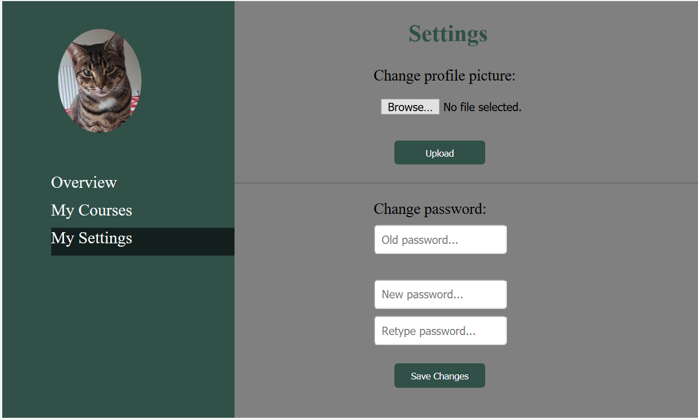
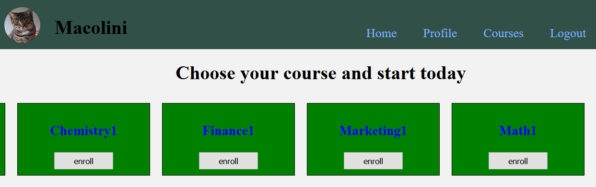
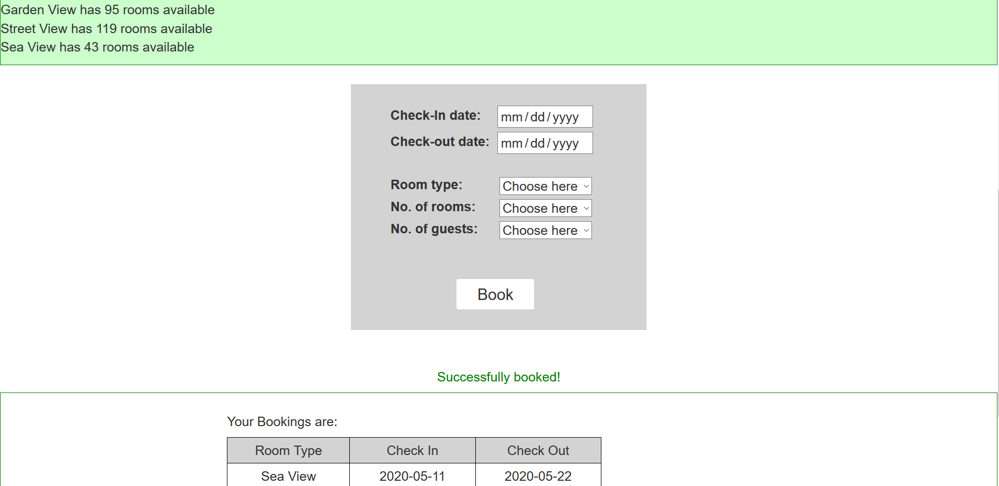

# Web Development Projects

## Project1 : Picnic Courses
 
#### Courses website in which a user can login/register
#### The user can upload new profile picture and/or change current password. Passwords are hashed in the database.
#### It also has a course page (simple) which list several different courses. The user can select the option "Enroll" and the course will appear in their profile under "courses" tab.
  

 

## Project2 : Hotel Booking System
 
#### Simple project which has a booking system of rooms. There are several room types and prices.
